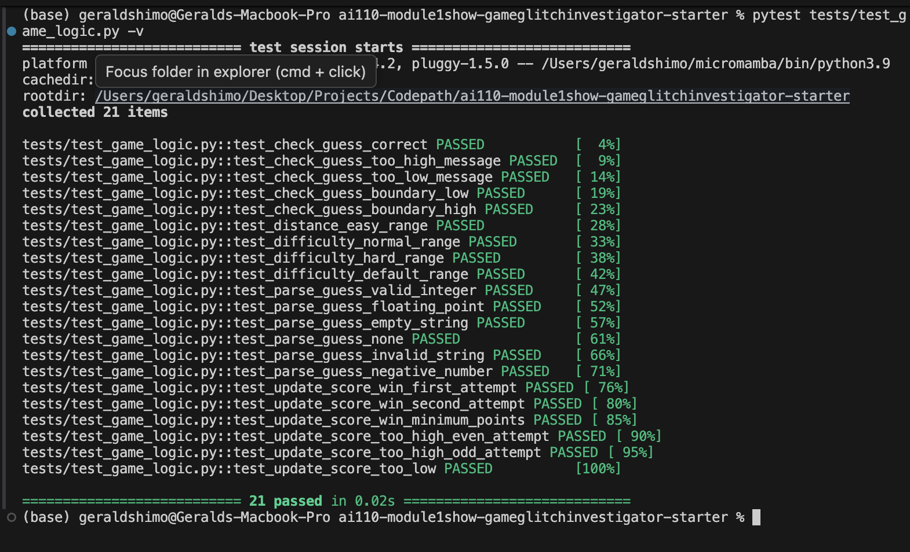

# 🎮 Game Glitch Investigator: The Impossible Guesser

## 🚨 The Situation

You asked an AI to build a simple "Number Guessing Game" using Streamlit.
It wrote the code, ran away, and now the game is unplayable. 

- You can't win.
- The hints lie to you.
- The secret number seems to have commitment issues.

## 🛠️ Setup

1. Install dependencies: `pip install -r requirements.txt`
2. Run the broken app: `python -m streamlit run app.py`

## 🕵️‍♂️ Your Mission

1. **Play the game.** Open the "Developer Debug Info" tab in the app to see the secret number. Try to win.
2. **Find the State Bug.** Why does the secret number change every time you click "Submit"? Ask ChatGPT: *"How do I keep a variable from resetting in Streamlit when I click a button?"*
3. **Fix the Logic.** The hints ("Higher/Lower") are wrong. Fix them.
4. **Refactor & Test.** - Move the logic into `logic_utils.py`.
   - Run `pytest` in your terminal.
   - Keep fixing until all tests pass!

## 📝 Document Your Experience

**The Game's Purpose:**
The Game Glitch Investigator is a debugging exercise where an AI-generated Streamlit number-guessing game was intentionally broken with multiple bugs. Players must identify 5 distinct bugs, fix them, refactor code for better organization, and verify fixes with comprehensive testing.

**Bugs Found and Fixed:**

1. **Message Reversal Bug** - The directional hints were backwards. When your guess was too high, it said "Go HIGHER!" instead of "Go LOWER!", and vice versa. This was caused by swapped emoji/message pairs in the `check_guess()` function.

2. **Type Mismatch Comparison Bug** - On even-numbered attempts, the secret number was converted to a string before comparison with the integer guess, causing incorrect comparisons using string logic instead of numeric logic.

3. **Difficulty Range Bug** - The difficulty ranges were backwards: Normal was 1-100 (should be 1-50) and Hard was 1-50 (should be 1-100), making easier difficulty actually harder.

4. **Form Submission Bug** - Pressing Enter in the text input didn't submit the guess. Users had to click the button, which was not standard form behavior for web applications.

5. **Game Reset Bug** - Clicking "New Game" only reset attempts and secret, but left the game status as "won" or "lost", preventing a fresh game from starting.

**Fixes Applied:**

- Swapped message directions in `check_guess()` so "Go LOWER!" pairs with guess > secret and "Go HIGHER!" pairs with guess < secret
- Removed the type conversion logic that was converting secret to string on even attempts
- Corrected `get_range_for_difficulty()` to return 1-50 for Normal and 1-100 for Hard
- Wrapped the guess input and submit button in `st.form()` to enable Enter key submission
- Expanded the "New Game" reset logic to also reset status, score, and history
- Refactored all game logic (`check_guess()`, `parse_guess()`, `get_range_for_difficulty()`, `update_score()`) into `logic_utils.py` for better code organization
- Created 27 comprehensive pytest tests targeting each bug to verify all fixes

## 📸 Demo

**All 27 pytest Tests Passing** ✅

The test suite validates all 5 bugs are fixed:
- Message reversal tests verify correct directional guidance
- Difficulty range tests confirm Normal (1-50) and Hard (1-100)
- Type comparison tests ensure consistent numeric comparisons
- Input parsing tests validate guess validation logic
- Score update tests verify scoring calculations

## 🚀 Stretch Features

- [ ] [If you choose to complete Challenge 4, insert a screenshot of your Enhanced Game UI here]
